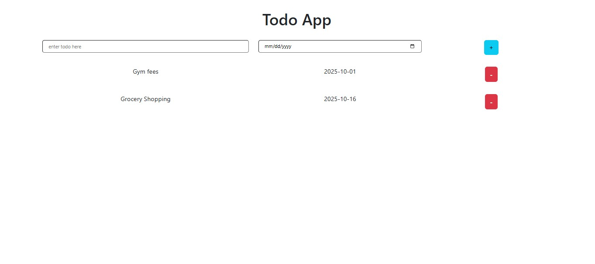

# 📝 Todo App

A simple React-based Todo application to manage daily tasks with due dates.  
This app allows users to add todos with a date, view them in a list, and delete them when completed.

## 🚀 Features

- Add a new todo with a title and due date
- Display list of all todos
- Delete a todo from the list
- Minimal and clean UI

## 🛠️ Built With

- React.js
- JavaScript
- CSS
- Html

## 📸 Screenshot

## 📂 How to Run Locally

1. Clone the repository

   git clone https://github.com/your-username/todo-app.git

2. Navigate to the project folder

   cd todo-app

3. Install dependencies

   npm install

4. Start the development server

   npm run dev
